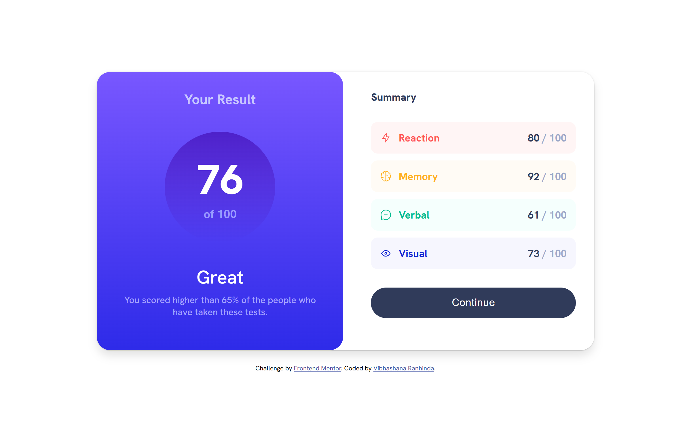

# Frontend Mentor - Results summary component solution

This is a solution to the [Results summary component challenge on Frontend Mentor](https://www.frontendmentor.io/challenges/results-summary-component-CE_K6s0maV). Frontend Mentor challenges help you improve your coding skills by building realistic projects.

## Table of contents

- [Overview](#overview)
  - [The challenge](#the-challenge)
  - [Screenshots](#screenshot)
  - [Links](#links)
- [My process](#my-process)
  - [Built with](#built-with)
  - [What I learned](#what-i-learned)
  - [Continued development](#continued-development)
  - [Useful resources](#useful-resources)
- [Author](#author)

## Overview

### The challenge

Users should be able to:

- View the optimal layout for the interface depending on their device's screen size.
- See hover and focus states for all interactive elements on the page.

### Screenshots

- **Mobile**

  

- **Desktop**

  

### Links

- Solution URL: [GitHub URL](https://github.com/vibhashan/results-summary-component-main.git)
- Live Site URL: [Netlify URL](https://results-summary-component-vibhashana.netlify.app/)

## My process

### Built with

- Semantic HTML5 markup
- Vanilla CSS with Flexbox
- Mobile-first workflow

### What I learned

- Responsive design with a mobile-first workflow.
- CSS flexbox and linear gradients.

### Continued development

- Add JavaScript to dynamically populate the content.
- Support for both light and dark themes.
- Tailwind CSS for styling and responsive design.

### Useful resources

- [W3Schools CSS Gradients](https://www.w3schools.com/css/css3_gradients.asp) - This helped me for understanding linear gradients.

## Author

- Frontend Mentor - [@vibhashan](https://www.frontendmentor.io/profile/vibhashan)
- LinkedIn Profile - (https://www.linkedin.com/in/vibhashana-ranhinda-b501a7205/)
